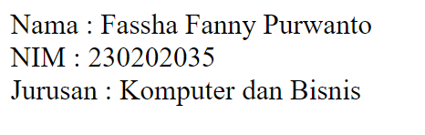
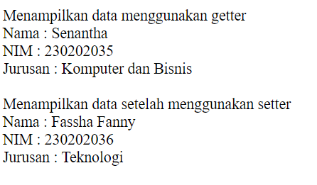
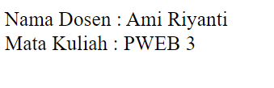
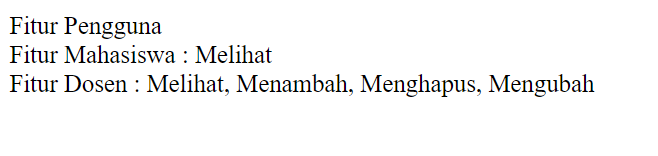
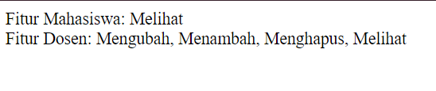

## MODUL 1 
### Jobsheet 1 : Implementasi Prinsip OOP dalam PHP
1. Membuat Class dan Object  
    _Class_ atau Kelas, adalah blueprint dasar dari pembuatan objek. Atribut dan metode yang ada pada objek akan didefinisikan oleh kelas. Sedangkan  _object_ atau objek, adalah instansiasi dari kelas. Umumnya objek memiliki elemen pelengkap berupa atribut dan metode.
   
   > Membuat class Mahasiswa dengan atribut nama, nim, dan jurusan  
   ``` PHP
   Class Mahasiswa {  
   public $nama;
   public $nim;
   public $jurusan;
   ```
   Membuat function construct untuk mengembalikan nilai
   ```PHP
    public function __construct($nama, $nim, $jurusan){
        $this->nama = $nama;
        $this->nim = $nim;
        $this->jurusan = $jurusan;
    }
   ```
   > Membuat metode tampilkanData()
   
   Metode ini digunakan untuk memanggil atribut dan menampilkannya.
   
   ```PHP
   function tampilkanData(){
        return "Nama : $this->nama <br> NIM : $this->nim <br> Jurusan : $this->jurusan";
    }
   }
   ```

> Instansiasi objek dari class Mahasiswa dan tampilkan data mahasiswa tersebut.

Instansiasi adalah cara untuk menghasilkan sebuah entitas konkrit berdasarkan blueprint (kelas) yang sudah ada.  

```PHP
$mhs1 = new Mahasiswa ("Fassha Fanny Purwanto", "230202035", "Komputer dan Bisnis");
echo $mhs1->tampilkanData();
```
> Full kode program
```PHP
<?php
/*
 Nama : Fassha Fanny Purwanto
 Kelas : TI - 2B
 NPM : 230202035 */

//Membuat class Mahasiswa
class Mahasiswa {

    //Membuat atribut nama, nim, dan jurusan
    public $nama;
    public $nim;
    public $jurusan;

// Membuat construct
    public function __construct($nama, $nim, $jurusan){
        $this->nama = $nama;
        $this->nim = $nim;
        $this->jurusan = $jurusan;
    }
    //Membuat function tampilkanData()
    public function tampilkanData(){
        return "Nama : $this->nama <br> NIM : $this->nim <br> Jurusan : $this->jurusan";
    }
}
//Instansiasi Objek
$mhs1 = new Mahasiswa ("Fassha Fanny Purwanto", "230202035", "Komputer dan Bisnis");
echo $mhs1->tampilkanData();
?>
```
> Output

  

2. Encapsulation  
   _Encapsulation_ atau enkapsulasi, adalah konsep yang memiliki fungsi untuk membungkus data dan metode. Enkapsulasi juga bertujuan untuk menyembunyikan detail implementasi.

   > Ubah atribut dalam class Mahasiswa menjadi private.

   ```PHP
   class Mahasiswa{
    private $nama;
    private $nim;
    private $jurusan;
   ```

Membuat function construct untuk inisialisasi  

```PHP
public function __construct($nama, $nim, $jurusan)
    {
        $this->nama = $nama;
        $this->nim = $nim;
        $this->jurusan = $jurusan;
    }
```

>  Membuat metode getter dan setter untuk atribut nama, nim, dan jurusan

Getter adalah metode yang digunakan untuk mengambil nilai dari atribut private. Biasanya, getter memberikan akses hanya-baca (read-only) ke atribut dari luar kelas.
    
 ```PHP
public function getNama() {
return "Nama    : $this->nama";
}
public function getNim() {
return "NIM    : $this->nim";
}
public function getJurusan() {
return "Jurusan    : $this->jurusan";
}
```
Setter adalah metode yang digunakan untuk memodifikasi nilai dari atribut private. Setter memungkinkan akses tulis (write) ke atribut dari luar kelas dengan memberikan validasi atau aturan khusus jika diperlukan.  
```PHP
public function setNama($nama) {
$this->nama = $nama;
}
public function setNim ($nim) {
$this->nim = $nim;
}
public function setJurusan ($jurusan) {
$this->jurusan = $jurusan;
}
```
> Demonstrasikan akses ke atribut menggunakan metode getter dan setter

```PHP
// Instansiasi Objek
$mhs1 = new Mahasiswa("Senantha", "230202035", "Komputer dan Bisnis");

echo "Menampilkan data menggunakan getter";
echo "<br>";

// Mengakses data menggunakan metode getter
echo $mhs1->getNama();
echo "<br>";
echo $mhs1->getNim();
echo "<br>";
echo $mhs1->getJurusan();
echo "<br><br>";

echo "Menampilkan data setelah menggunakan setter";
echo "<br>";

// Mengubah data menggunakan metode setter
$mhs1->setNama("Fassha Fanny");
$mhs1->setNim("230202036");
$mhs1->setJurusan("Teknologi");

// Menampilkan data setelah perubahan menggunakan getter
echo $mhs1->getNama();
echo "<br>";
echo $mhs1->getNim();
echo "<br>";
echo $mhs1->getJurusan();
```

>Full kode program

```PHP
<?php
/*
 Nama : Fassha Fanny Purwanto
 Kelas : TI - 2B
 NPM : 230202035 */

// Membuat class Mahasiswa
class Mahasiswa
{

    // Membuat atribut private
    private $nama;
    private $nim;
    private $jurusan;

    // Constructor
    public function __construct($nama, $nim, $jurusan)
    {
        $this->nama = $nama;
        $this->nim = $nim;
        $this->jurusan = $jurusan;
    }

    // Method Getter untuk nama
    public function getNama()
    {
        return "Nama : $this->nama";
    }

    // Method Setter untuk nama
    public function setNama($nama)
    {
        $this->nama = $nama;
    }

    // Method Getter untuk nim
    public function getNim()
    {
        return "NIM : $this->nim";
    }

    // Method Setter untuk nim
    public function setNim($nim)
    {
        $this->nim = $nim;
    }

    // Method Getter untuk jurusan
    public function getJurusan()
    {
        return "Jurusan : $this->jurusan";
    }

    // Method Setter untuk jurusan
    public function setJurusan($jurusan)
    {
        $this->jurusan = $jurusan;
    }
}

// Instansiasi Objek
$mhs1 = new Mahasiswa("Senantha", "230202035", "Komputer dan Bisnis");

echo "Menampilkan data menggunakan getter";
echo "<br>";

// Mengakses data menggunakan metode getter
echo $mhs1->getNama();
echo "<br>";
echo $mhs1->getNim();
echo "<br>";
echo $mhs1->getJurusan();
echo "<br><br>";

echo "Menampilkan data setelah menggunakan setter";
echo "<br>";

// Mengubah data menggunakan metode setter
$mhs1->setNama("Fassha Fanny");
$mhs1->setNim("230202036");
$mhs1->setJurusan("Teknologi");

// Menampilkan data setelah perubahan menggunakan getter
echo $mhs1->getNama();
echo "<br>";
echo $mhs1->getNim();
echo "<br>";
echo $mhs1->getJurusan();
```

> Output

  

3. Inheritance
   
 _Inheritance_ atau pewarisan, adalah konsep dimana implementasinya adalah dengan adanya kelas baru yang dibuat dengan mewarisi atribut dan metode dari kelas _parent_ nya.

> Membuat class Pengguna dengan atribut nama dan metode getNama()

```PHP
// Membuat class Pengguna
class Pengguna
{

    //Atribut
    protected $nama;

    // Function construct
    public function __construct($nama)
    {
        $this->nama = $nama;
    }

    // Method untuk getNama
    public function getNama()
    {
        return $this->nama;
    }
}
```
> Membuat class Dosen yang mewarisi class Pengguna dan tambahkan atribut
mataKuliah

```PHP
class Dosen extends Pengguna
{
    private $mataKuliah;

    // Function construct
    public function __construct($nama, $mataKuliah)
    {
        // Memanggil constructor dari class 'orang tua'
        parent::__construct($nama);
        $this->mataKuliah = $mataKuliah;
    }

    // Method Getter untuk mataKuliah
    public function getMataKuliah()
    {
        return $this->mataKuliah;
    }
}
```
> Instansiasi objek dari class Dosen dan tampilkan data dosen

```PHP
// Instansiasi objek dari class Dosen
$dosen1 = new Dosen("Ami Riyanti", "PWEB 3");

// Menampilkan data dosen
echo "Nama Dosen  : " . $dosen1->getNama() . "<br>";
echo "Mata Kuliah : " . $dosen1->getMataKuliah();
```

>Full Kode Program

```PHP
<?php
/*
 Nama : Fassha Fanny Purwanto
 Kelas : TI - 2B
 NPM : 230202035 */

// Membuat class Pengguna
class Pengguna
{

    //Atribut
    protected $nama;

    // Function construct
    public function __construct($nama)
    {
        $this->nama = $nama;
    }

    // Method untuk getNama
    public function getNama()
    {
        return $this->nama;
    }
}

// Membuat class Dosen yang mewarisi Pengguna
class Dosen extends Pengguna
{
    private $mataKuliah;

    // Function construct
    public function __construct($nama, $mataKuliah)
    {
        // Memanggil constructor dari class 'orang tua'
        parent::__construct($nama);
        $this->mataKuliah = $mataKuliah;
    }

    // Method Getter untuk mataKuliah
    public function getMataKuliah()
    {
        return $this->mataKuliah;
    }
}

// Instansiasi objek dari class Dosen
$dosen1 = new Dosen("Ami Riyanti", "PWEB 3");

// Menampilkan data dosen
echo "Nama Dosen  : " . $dosen1->getNama() . "<br>";
echo "Mata Kuliah : " . $dosen1->getMataKuliah();
```

>Output



4. Polymorphism

_Polymorphism_ atau Polimorfisme, adalah konsep kelas yang bertujuan untuk mempermudah implementasi program dengan cara menggunakan objek dari kelas yang berbeda tetapi menggunakan metode yang sama namun hasil implementasi nya berbeda.  

> Membuat class Pengguna dengan metode aksesFitur().

```PHP
class Pengguna
{
    //Function Construct
    public function __construct() {}

    // Method aksesFitur 
    public function aksesFitur()
    {
        return  "Fitur Pengguna ";
    }
}
```

> Implementasikan aksesFitur() dengan cara berbeda di class Dosen dan
Mahasiswa

Mengimplementasikan metode aksesFitur di kelas Dosen
```PHP
class Dosen extends Pengguna
{
    public function __construct() {}

    //Method aksesFitur() pada class Dosen
    public function aksesFitur()
    {
        return "Melihat, Menambah, Menghapus, Mengubah ";
    }
}
```
Mengimplementasikan metode aksesFitur di kelas Mahasiswa  

```PHP
class Mahasiswa extends Pengguna
{

    public function __construct() {}

    // Method aksesFitur pada class Mahasiswa
    public function aksesFitur()
    {
        return "Melihat";
    }
}
```
> Instansiasi objek dari class Dosen dan Mahasiswa, lalu panggil metode
aksesFitur()

```PHP
// Membuat objek Mahasiswa dan Dosen
$mahasiswa = new Mahasiswa();
$dosen = new Dosen();
$pengguna = new pengguna();

// Memanggil metode aksesFitur()
echo $pengguna ->aksesFitur() ."<br>";
echo "Fitur Mahasiswa   : " . $mahasiswa->aksesFitur() . "<br>";
echo "Fitur Dosen   : " . $dosen->aksesFitur() . "<br>";
```

>Full Kode Program

```PHP
<?php
/*
 Nama : Fassha Fanny Purwanto
 Kelas : TI - 2B
 NPM : 230202035 */


// Membuat class Pengguna
class Pengguna
{
    //Function Construct
    public function __construct() {
        
    }

    // Method aksesFitur 
    public function aksesFitur()
    {
        return  "Fitur Pengguna ";
    }
}

// Membuat class Dosen yang mewarisi Pengguna
class Dosen extends Pengguna
{
    public function __construct() {}

    //Method aksesFitur() pada class Dosen
    public function aksesFitur()
    {
        return "Melihat, Menambah, Menghapus, Mengubah ";
    }
}

// Membuat class Mahasiswa yang mewarisi Pengguna
class Mahasiswa extends Pengguna
{

    public function __construct() {}

    // Method aksesFitur pada class Mahasiswa
    public function aksesFitur()
    {
        return "Melihat";
    }
}

// Membuat objek Mahasiswa dan Dosen
$mahasiswa = new Mahasiswa();
$dosen = new Dosen();
$pengguna = new pengguna();

// Memanggil metode aksesFitur()
echo $pengguna ->aksesFitur() ."<br>";
echo "Fitur Mahasiswa   : " . $mahasiswa->aksesFitur() . "<br>";
echo "Fitur Dosen   : " . $dosen->aksesFitur() . "<br>";
```


>Output

  

5. Abstraction

_Abstraction_ atau abstraksi adalah konsep yang memiliki fungsi untuk menyederhanakan kode dengan cara menyembunyikan detail yang tidak perlu  

>Membuat class abstrak Pengguna dengan metode abstrak aksesFitur()

```PHP
// Membuat class abstrak Pengguna
abstract class Pengguna
{
    public function __construct() {}

    //absract method aksesFitur
    abstract public function aksesFitur();
}
```

>Implementasikan class Mahasiswa dan Dosen yang mengimplementasikan
metode abstrak tersebut

Kelas Dosen yang mengimplementasikan metode absract aksesFitur  
```PHP
class Dosen extends Pengguna
{

    public function __construct() {}

    // method aksesFitur pada kelas Dosen
    public function aksesFitur()
    {
        return "Mengubah, Menambah, Menghapus, Melihat ";
    }
}
```
Kelas Mahasiswa yang mengimplementasikan metode abstract aksesFitur  
```PHP
class Mahasiswa extends Pengguna
{


    public function __construct() {}

    // method aksesFitur pada kelas Mahasiswa
    public function aksesFitur()
    {
        return "Melihat ";
    }
}
```

> Demonstrasikan dengan memanggil metode aksesFitur() dari objek yang
diinstansiasi

```PHP
// Membuat objek Mahasiswa dan Dosen
$mahasiswa = new Mahasiswa();
$dosen = new Dosen();

// Memanggil metode aksesFitur()
echo "Fitur Mahasiswa: " . $mahasiswa->aksesFitur() . "<br>";
echo "Fitur Dosen: " . $dosen->aksesFitur() . "<br>";
```
>Full Kode Program

```PHP
<?php
/*
 Nama : Fassha Fanny Purwanto
 Kelas : TI - 2B
 NPM : 230202035 */

// Membuat class abstrak Pengguna
abstract class Pengguna
{
    public function __construct() {}

    //absract method aksesFitur
    abstract public function aksesFitur();
}

// Membuat class Dosen yang mewarisi Pengguna
class Dosen extends Pengguna
{

    public function __construct() {}

    // method aksesFitur pada kelas Dosen
    public function aksesFitur()
    {
        return "Mengubah, Menambah, Menghapus, Melihat ";
    }
}

// Membuat class Mahasiswa yang mewarisi Pengguna
class Mahasiswa extends Pengguna
{


    public function __construct() {}

    // method aksesFitur pada kelas Mahasiswa
    public function aksesFitur()
    {
        return "Melihat ";
    }
}


// Membuat objek Mahasiswa dan Dosen
$mahasiswa = new Mahasiswa();
$dosen = new Dosen();

// Memanggil metode aksesFitur()
echo "Fitur Mahasiswa: " . $mahasiswa->aksesFitur() . "<br>";
echo "Fitur Dosen: " . $dosen->aksesFitur() . "<br>";
?>
```


>Output

  


   

