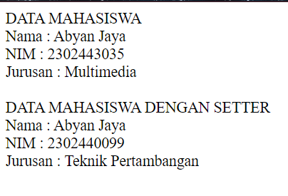
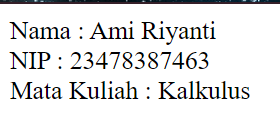

## Modul 2
### Jobsheet 2 : Menggunakan Konsep Kelas dan Objek dalam PHP  
#### A. Jobsheet 2
1. Membuat Class dan Object
> Membuat class Mahasiswa yang memiliki atribut nama, nim, dan jurusan

```PHP
class Mahasiswa {
    private $nama;
    private $nim;
    private $jurusan;
```
Membuat Construct untuk inisialisasi  
```PHP
public function __construct($nama, $nim, $jurusan) {
        $this->nama = $nama;
        $this->nim = $nim;
        $this->jurusan = $jurusan;
    }
```
> Membuat metode tampilkanData() dalam class Mahasiswa

```PHP
 public function tampilkanData() {
        return "Nama    : " . $this->nama . "<br>NIM    : " . $this->nim . "<br>Jurusan : " . $this->jurusan;
    }
```

> Instansiasi objek dari class Mahasiswa dan tampilkan data mahasiswa tersebut


```PHP
$mhs1= new Mahasiswa("Abyan Jaya", "2302443035", "Multimedia");
```

2. Implementasi Constructor

> Tambahkan constructor pada kelas Mahasiswa yang akan menginisialisasi
atribut nama, nim, dan jurusan

```PHP
public function __construct($nama, $nim, $jurusan) {
        $this->nama = $nama;
        $this->nim = $nim;
        $this->jurusan = $jurusan;
    }
```
 3. Membuat Metode Tambahan

> Buat metode updateJurusan() dalam kelas Mahasiswa yang memungkinkan
perubahan jurusan

```PHP
 public function updateJurusan($jurusan2) {
        $this->jurusan = $jurusan2;
    }
```
4. Penggunaan Atribut dan Metode

> Ubah nilai atribut nim dari objek Mahasiswa menggunakan metode setter


```PHP
public function setNim($nim2) {
        $this->nim = $nim2;
    }
```
>  Tampilkan data mahasiswa yang sudah diperbarui dengan memanggil metode
tampilkanData()

```PHP
// Menampilkan data mahasiswa
echo "DATA MAHASISWA";
echo "<br>";
echo $mhs1->tampilkanData();
echo "<br>";
echo "<br>";

// Mengubah jurusan 
$mhs1->updateJurusan("Teknik Pertambangan");

// Mengubah NIM 
$mhs1->setNim("2302440099");

// Menampilkan data mahasiswa setelah di update
echo "DATA MAHASISWA DENGAN SETTER";
echo "<br>";
echo $mhs1->tampilkanData();
```
> Full Kode Program

```PHP
<?php
//Buat class Mahasiswa yang memiliki atribut nama, nim, dan jurusan.
class Mahasiswa {
    private $nama;
    private $nim;
    private $jurusan;

    //Tambahkan constructor pada kelas Mahasiswa
    public function __construct($nama, $nim, $jurusan) {
        $this->nama = $nama;
        $this->nim = $nim;
        $this->jurusan = $jurusan;
    }

    //Buat metode tampilkanData() dalam class Mahasiswa.
    public function tampilkanData() {
        return "Nama    : " . $this->nama . "<br>NIM    : " . $this->nim . "<br>Jurusan : " . $this->jurusan;
    }

    //Buat metode updateJurusan() dalam kelas Mahasiswa
    public function updateJurusan($jurusan2) {
        $this->jurusan = $jurusan2;
    }

    // Setter untuk atribut nim
    public function setNim($nim2) {
        $this->nim = $nim2;
    }
}

// Instansiasi objek 
$mhs1= new Mahasiswa("Abyan Jaya", "2302443035", "Multimedia");

// Menampilkan data mahasiswa
echo "DATA MAHASISWA";
echo "<br>";
echo $mhs1->tampilkanData();
echo "<br>";
echo "<br>";

// Mengubah jurusan 
$mhs1->updateJurusan("Teknik Pertambangan");

// Mengubah NIM 
$mhs1->setNim("2302440099");

// Menampilkan data mahasiswa setelah di update
echo "DATA MAHASISWA DENGAN SETTER";
echo "<br>";
echo $mhs1->tampilkanData();
?>
```
>Output

  

#### B. Tugas  

> Implementasikan kelas Dosen dengan atribut nama, nip, dan mataKuliah

```PHP
class Dosen {
    //atribut dosen
    public $nama;
    public $nip;
    public $mataKuliah;
```
Membuat function Construct untuk inisialisasi  
```PHP
 public function __construct($nama, $nip, $mataKuliah) {
        $this->nama = $nama;
        $this->nip = $nip;
        $this->mataKuliah = $mataKuliah;
    }
```
> Membuat metode tampilkanDosen() untuk menampilkan informasi dosen

```PHP
public function tampilkanDosen(){
        return "Nama    : " .$this->nama. "<br>NIP   : " .$this->nip. "<br>Mata Kuliah    : ".$this->mataKuliah;
    }
        
    }
    ```
>Membuat objek dari kelas Dosen, dan gunakan metode tampilkanDosen() untuk
menampilkan informasi tersebut

```PHP
 $dsn1 = new Dosen ("Ami Riyanti", "23478387463", "Kalkulus");
    echo $dsn1->tampilkanDosen();
   ```

>Full Kode Program

```PHP
<?php
//membuat class dosen
class Dosen {
    //atribut dosen
    public $nama;
    public $nip;
    public $mataKuliah;

    //function construct
    public function __construct($nama, $nip, $mataKuliah) {
        $this->nama = $nama;
        $this->nip = $nip;
        $this->mataKuliah = $mataKuliah;
    }
    
    //method tampilkanDosen
    public function tampilkanDosen(){
        return "Nama    : " .$this->nama. "<br>NIP   : " .$this->nip. "<br>Mata Kuliah    : ".$this->mataKuliah;
    }
        
    }
    
    $dsn1 = new Dosen ("Ami Riyanti", "23478387463", "Kalkulus");
    echo $dsn1->tampilkanDosen();
    ?>
```

>Output




   


