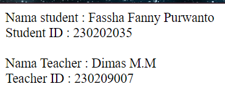
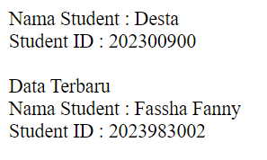
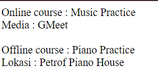
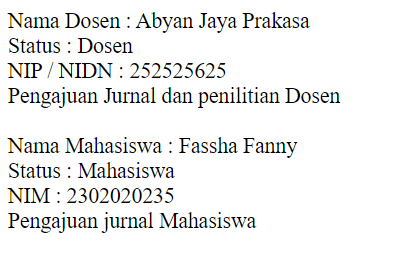

## MODUL 3
### Jobsheet 3 : Menerapkan Konsep Inheritance, Polymorphism, Encapsulation, dan Abstraction dalam PHP  
#### A. Jobsheet 3  
1. Inheritance

   > Membuat kelas Person dengan atribut name dan metode getName().

Potongan Program dibawah memiliki kelas dengan nama Person dan atribut name. Program ini juga memiliki metode yaitu metode getName untuk memanggil atribut name. 

   ```PHP
   class Person {
   public $name;

public function getName() {
        return $this->name;
    }
}
   ```

>Membuat kelas Student yang mewarisi dari Person dan tambahkan atribut studentID
serta metode getStudentID()

```PHP
class student extends Person {
    public $studentID;

    //membuat method getStudentID
    public function getStudentID() {
        return $this->studentID;
    }
}
```

>Instansiasi objek dan menampilkan data dengan echo


```PHP
$student = new Student();
echo "Nama : ". $student->name = "Fassha Fanny Purwanto"; 
echo"<br>";
echo "Student ID : ". $student->studentID = "274837264";
echo "<br>";
?>
```
>Full kode Program

```PHP
<?php
// membuat Kelas Person
class Person {
    public $name;

    //membuat method getName
    public function getName() {
        return $this->name;
    }
}


// membuat class Student yang mewarisi Person
class Student extends Person {
    public $studentID;

    //membuat method getStudentID
    public function getStudentID() {
        return $this->studentID;
    }
}
$student = new Student();
echo "Nama : ". $student->name = "Fassha Fanny Purwanto"; 
echo"<br>";
echo "Student ID : ". $student->studentID = "274837264";
echo "<br>";
?>
```
>Output

  

2. Polymorphism

> Membuat kelas Teacher yang juga mewarisi dari Person dan tambahkan atribut
teacherID

Potongan program dibawah memiliki kelas turunan dari person yang  bernama class Teacher dengan atribut dan metode class Person yang diturunkan  

```PHP
class Teacher extends Person {
    public $teacherID;

    public function getTeacherID() {
        return $this->teacherID;
    }
```
>Override metode getName() di kelas Student dan Teacher untuk menampilkan
format berbeda

Override adalah mekanisme untuk menggantikan implementasi metode yang diwarisi dari superclass dalam subclass. Override memungkinkan subclass untuk mengubah atau menambah perilaku metode tanpa mengubah implementasi di superclass.  


```PHP
public function getName() {
        return "Teacher Name : " . $this->name;
    }
// Override metode getName()
    public function getName() {
        return "Student : " . $this->name;
    }
}
```
> Full kode program

```PHP
<?php
// membuat Kelas Person
class Person {
    public $name;

    //membuat method getName
    public function getName() {
        return $this->name;
    }
}


// membuat class Student yang mewarisi Person
class Student extends Person {
    public $studentID;

    //membuat method getStudentID
    public function getStudentID() {
        return $this->studentID;
    }
    
    // Override metode getName()
    public function getName() {
        return "Student : " . $this->name;
    }
}
// Kelas Teacher yang mewarisi dari Person
class Teacher extends Person {
    public $teacherID;

    public function getTeacherID() {
        return $this->teacherID;
    }

    // Override metode getName()
    public function getName() {
        return "Teacher: " . $this->name;
    }
}

$student1 = new student();
$teacher1 = new teacher();

echo "Nama student : " .$student1->name = "Fassha Fanny Purwanto". "<br>";
echo "Student ID : ".$student1->studentID = "230202035". "<br><br>";
echo "Nama Teacher : ". $teacher1 ->name = "Dimas M.M". "<br>";
echo "Teacher ID : ". $teacher1->teacherID = "230209007". "<br>";
?>

```
>Output

  

3. Encapsulation

   
 > Mengubah atribut name dan studentID dalam kelas Student menjadi private

Mengubah atribut name menjadi private. Anggota kelas yang dideklarasikan sebagai private hanya dapat diakses dari dalam kelas itu sendiri, tidak dari subclass atau kelas lain.  


```PHP
public function getNamePrivate() {
        return "Nama Student : ". $this->name;
    }
```

Mengubah atribut studentID menjadi private  
```PHP
public function getStudentIDPrivate() {
        return "Student ID : ". $this->studentID;
    
```
>Tambahkan metode setter dan getter untuk mengakses dan mengubah nilai
atribut name dan studentID

Membuat metode setter untuk mengubah nilai  

```PHP
 public function setName($name) {
        $this->name = $name;
    }
public function setStudentID($studentID) {
        $this->studentID = $studentID;
    }
```

Membuat metode getter untuk mengakses nilai  

```PHP
 public function getStudentID() {
        return $this->studentID;
    }
  public function getName() {
        return "Student Name: " . $this->name;
    }
```

> Full Kode Program

```PHP
<?php
// membuat Kelas Person
class Person {
    public $name;

    //membuat method getName
    public function getName() {
        return $this->name;
    }
}


// membuat class Student yang mewarisi Person
class Student extends Person {
    private $studentID;

    //membuat method getStudentID
    public function getStudentID() {
        return $this->studentID;
    }

    // Override metode getName()
    public function getName() {
        return "Nama Student : " . $this->name;
    }

    // Getter dan Setter untuk atribut name
    public function getNamePrivate() {
        return "Nama Student : ". $this->name;
    }

    public function setName($name) {
        $this->name = $name;
    }

    // Getter dan Setter untuk atribut studentID
    public function getStudentIDPrivate() {
        return "Student ID : ". $this->studentID;
    }

    public function setStudentID($studentID) {
        $this->studentID = $studentID;
    }
}

$student1 = new student ();
$student1->setStudentID("202300900");
$student1->setName("Desta");
echo $student1->getNamePrivate(). "<br>";
echo $student1->getStudentIDPrivate().  "<br><br>";

$student1->setStudentID("2023983002");
$student1->setName("Fassha Fanny ");
//menampilkan data setelah update menggunakan set
echo "Data Terbaru";
echo "<br>";
echo $student1->getName(). "<br>";
echo "Student ID : ".$student1->getStudentID(). "<br><br>";
?>
```
> Output

  

4. Abstraction

> Membuat kelas abstrak Course dengan metode abstrak getCourseDetails()

```PHP
abstract class Course {

    abstract public function getCourseDetails();
}
```

> Buat kelas OnlineCourse dan OfflineCourse yang mengimplementasikan
getCourseDetails() untuk memberikan detail yang berbeda

Membuat class OnlineCourse yang merupakan subclass atau kelas turunan dari class Course  


```PHP
class OnlineCourse extends Course {
private $nama;
    private $media;

   public function setNama($nama) {
    $this->nama = $nama;
   }
   public function setMedia($media) {
    $this->media = $media;
   }
    public function getCourseDetails() {
        return "Online course : ".$this->nama. "<br>" ."Media : ".$this->media;
    }
}

```

Membuat class OfflineCourse yang merupakan kelas turunan dari class Course  


```PHP
class OfflineCourse extends Course {
    private $nama;
    private $lokasi;

    public function setNama($nama) {
        $this->nama = $nama;
       }

       public function setLokasi($lokasi) {
        $this->lokasi = $lokasi;
       }

    public function getCourseDetails() {
        return "Offline course : ". $this->nama."<br>". "Lokasi : " .$this->lokasi;
    }
}
```
> Full kode program

```PHP
<?php
// Kelas abstrak Course
abstract class Course {
    abstract public function getCourseDetails();
}

// Kelas OnlineCourse yang mengimplementasikan Course
class OnlineCourse extends Course {
private $nama;
    private $media;

   public function setNama($nama) {
    $this->nama = $nama;
   }
   public function setMedia($media) {
    $this->media = $media;
   }
    public function getCourseDetails() {
        return "Online course : ".$this->nama. "<br>" ."Media : ".$this->media;
    }
}

// Kelas OfflineCourse yang mengimplementasikan Course
class OfflineCourse extends Course {
    private $nama;
    private $lokasi;

    public function setNama($nama) {
        $this->nama = $nama;

       }

       public function setLokasi($lokasi) {
        $this->lokasi = $lokasi;
       }

    public function getCourseDetails() {
        return "Offline course : ". $this->nama."<br>". "Lokasi : " .$this->lokasi;
    }
}

$onlinecourse1 =  new OnlineCourse();
$offlinecourse1 =  new OfflineCourse();

// Mengatur detail kursus untuk OnlineCourse
$onlinecourse1->setNama("Music Practice");
$onlinecourse1->setMedia("GMeet");


// Mengatur detail kursus untuk OfflineCourse
$offlinecourse1->setNama("Piano Practice");
$offlinecourse1->setLokasi("Petrof Piano House");


// Menampilkan detail kursus
echo $onlinecourse1->getCourseDetails(); 
echo "<br>";
echo "<br>";
echo $offlinecourse1->getCourseDetails();
?>
 ```

> Output

 

#### B. Tugas  
1. Implementasikan kelas Person sebagai induk dari Dosen dan Mahasiswa

   Potongan program dibawah mendefinisikan class person dengan bentuk abstarct yang berperan sebagai kelas induk atau parent untuk kelas dosen dan mahasiswa.
   

```PHP
abstract class Person {
    protected $name;
 public function getName() {
        return $this->name;
    }
    public function setName($name) {
        return $this->name = $name;
    }

```

2. Gunakan konsep Inheritance untuk membuat hierarki kelas yang memungkinkan
Dosen dan Mahasiswa memiliki atribut dan metode yang sesuai dengan perannya

```PHP
class Dosen extends Person {
    private $nidn;

    // Getter dan Setter untuk atribut nidn
    public function getNidn() {
        return $this->nidn;
    }

    public function setNidn($nidn) {
        $this->nidn = $nidn;
    }

}

// Kelas Mahasiswa yang mewarisi dari Person
class Mahasiswa extends Person {
    private $nim;

    // Getter dan Setter untuk atribut nim
    public function getNim() {
        return $this->nim;
    }

    public function setNim($nim) {
        $this->nim = $nim;
    }

}
```

3. Terapkan Polymorphism dengan membuat metode getRole() di kelas Person dan
override metode ini di kelas Dosen dan Mahasiswa untuk menampilkan peran yang
berbeda

Metode getRole berfungsi untuk mengakses nilai dari atribut yang menyimpan informasi tentang peran (role) atau status pengguna (user role) dalam sebuah sistem.  

```PHP
abstract public function getRole();
}
// Override metode getRole()
    public function getRole() {
        return "Dosen";
    }
 // Override metode getRole()
    public function getRole() {
        return "Mahasiswa";
    }
```

4.  Gunakan Encapsulation untuk melindungi atribut nidn di kelas Dosen dan nim di
kelas Mahasiswa

Membuat atirbut nidn didalam kelas dosen menjadi private agar hanya bisa diakses dari kelas yang sama  

```PHP
class Dosen extends Person {
    private $nidn;
```
Membuat atribut nim didalam kelas mahasiswa menjadi private agar hanya bisa diakses dari kelas yang sama.  

```PHP
class Mahasiswa extends Person {
    private $nim;
```

5. Membuat kelas abstrak Jurnal dan implementasikan konsep Abstraction dengan
membuat kelas turunan JurnalDosen dan JurnalMahasiswa yang masing-masing
memiliki cara tersendiri untuk mengelola pengajuan jurnal

```PHP
abstract class Jurnal {

    abstract public function Submission();
}

// Kelas JurnalDosen yang mengimplementasikan Jurnal
class JurnalDosen extends Jurnal {
    
    public function Submission() {
        return "Pengajuan Jurnal dan penilitian Dosen";
    }
}


// Kelas JurnalMahasiswa yang mengimplementasikan Jurnal
class JurnalMahasiswa extends Jurnal {
   
    public function Submission()
    {
        return "Pengajuan jurnal Mahasiswa";
    }
}
```
> Full Kode Program

```PHP
<?php
// Kelas Person
abstract class Person {
    protected $name;

    public function getName() {
        return $this->name;
    }
    public function setName($name) {
        return $this->name = $name;
    }

    // Metode abstrak yang akan di-override oleh kelas turunannya
    abstract public function getRole();
}

// Kelas Dosen yang mewarisi dari Person
class Dosen extends Person {
    private $nidn;

    // Getter dan Setter untuk atribut nidn
    public function getNidn() {
        return $this->nidn;
    }

    public function setNidn($nidn) {
        $this->nidn = $nidn;
    }

    // Override metode getRole()
    public function getRole() {
        return "Dosen";
    }
}

// Kelas Mahasiswa yang mewarisi dari Person
class Mahasiswa extends Person {
    private $nim;

    // Getter dan Setter untuk atribut nim
    public function getNim() {
        return $this->nim;
    }

    public function setNim($nim) {
        $this->nim = $nim;
    }

    // Override metode getRole()
    public function getRole() {
        return "Mahasiswa";
    }
}

// Kelas abstrak Jurnal
abstract class Jurnal {

    abstract public function Submission();
}

// Kelas JurnalDosen yang mengimplementasikan Jurnal
class JurnalDosen extends Jurnal {
    
    public function Submission() {
        return "Pengajuan Jurnal dan penilitian Dosen";
    }
}

// Kelas JurnalMahasiswa yang mengimplementasikan Jurnal
class JurnalMahasiswa extends Jurnal {
   
    public function Submission()
    {
        return "Pengajuan jurnal Mahasiswa";
    }
}

$dosen1 = new Dosen();
$dosen1->setName("Abyan Jaya Prakasa");
$dosen1->setNidn("252525625");
echo "Nama Dosen    : " . $dosen1->getName() . "<br>";
echo "Status    : " . $dosen1->getRole() . "<br>";
echo "NIP / NIDN    : " . $dosen1->getNidn() . "<br>";

$jurnalDosen1 = new JurnalDosen();
echo $jurnalDosen1->Submission(). "<br>";
 echo "<br>";

$mahasiswa1 = new Mahasiswa();
$mahasiswa1->setName("Fassha Fanny");
$mahasiswa1->setNim("2302020235");
echo "Nama Mahasiswa    : " . $mahasiswa1->getName() . "<br>";
echo "Status : " . $mahasiswa1->getRole() . "<br>";
echo "NIM : " . $mahasiswa1->getNim() . "<br>";

$jurnalMahasiswa1 = new JurnalMahasiswa();
echo $jurnalMahasiswa1->Submission() . "<br>";
?>

```

>Output



