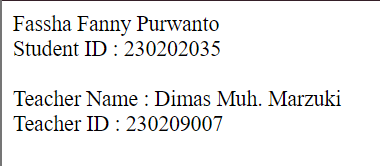
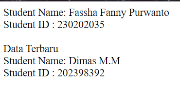
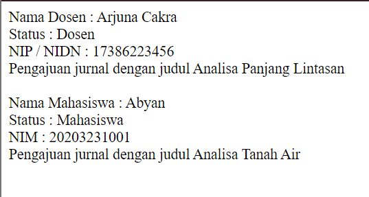

## MODUL 3
### Jobsheet 3 : Menerapkan Konsep Inheritance, Polymorphism, Encapsulation, dan Abstraction dalam PHP  
#### A. Jobsheet 3  
1. Inheritance

   > Membuat kelas Person dengan atribut name dan metode getName().

   ```PHP
   class Person {
   protected $name;
   ```

Membuat function construct untuk menginisialisasi

```PHP
public function __construct($name) {
        $this->name = $name;
    }
```
>Membuat kelas Student yang mewarisi dari Person dan tambahkan atribut studentID
serta metode getStudentID()

```PHP
class student extends Person {
    private $studentID;

    public function __construct($name, $studentID) {
        parent::__construct($name);
        $this->studentID = $studentID;
    }

    //membuat method getStudentID
    public function getStudentID() {
        return $this->studentID;
    }
}
```
> Membuat metode getName()

```PHP
public function getName() {
        return $this->name;
    }
}
```
>Instansiasi dan menampilkan data

```PHP
$student = new Student("Fassha Fanny Purwanto", "8374657");
echo "Name   : ". $student->getName(); 
echo"<br>";
echo "Student ID    : ". $student->getStudentID(); 
echo "<br>";
```
>Full kode Program

```PHP
<?php
// membuat Kelas Person
class Person {
    protected $name;

    public function __construct($name) {
        $this->name = $name;
    }

    //membuat method getName
    public function getName() {
        return $this->name;
    }
}


// membuat class Student yang mewarisi Person
class student extends Person {
    private $studentID;

    public function __construct($name, $studentID) {
        parent::__construct($name);
        $this->studentID = $studentID;
    }

    //membuat method getStudentID
    public function getStudentID() {
        return $this->studentID;
    }
}
$student = new Student("Fassha Fanny Purwanto", "8374657");
echo "Name   : ". $student->getName(); 
echo"<br>";
echo "Student ID    : ". $student->getStudentID(); 
echo "<br>";
```
>Output

  

2. Polymorphism

> Membuat kelas Teacher yang juga mewarisi dari Person dan tambahkan atribut
teacherID

```PHP
class Teacher extends Person {
    private $teacherID;

    public function __construct($name, $teacherID) {
        parent::__construct($name);
        $this->teacherID = $teacherID;
    }

    public function getTeacherID() {
        return $this->teacherID;
    }
```
>Override metode getName() di kelas Student dan Teacher untuk menampilkan
format berbeda

```PHP
public function getName() {
        return "Teacher Name : " . $this->name;
    }
}
```
> Full kode program

```PHP

<?php
// membuat Kelas Person
class Person {
    protected $name;

    public function __construct($name) {
        $this->name = $name;
    }

    //membuat method getName
    public function getName() {
        return $this->name;
    }
}


// membuat class Student yang mewarisi Person
class Student extends Person {
    private $studentID;

    public function __construct($name, $studentID) {
        parent::__construct($name);
        $this->studentID = $studentID;
    }

    //membuat method getStudentID
    public function getStudentID() {
        return $this->studentID;
    }
}
// Kelas Teacher yang mewarisi dari Person
class Teacher extends Person {
    private $teacherID;

    public function __construct($name, $teacherID) {
        parent::__construct($name);
        $this->teacherID = $teacherID;
    }

    public function getTeacherID() {
        return $this->teacherID;
    }

    // Override metode getName()
    public function getName() {
        return "Teacher Name : " . $this->name;
    }
}

$student1 = new student("Fassha Fanny Purwanto", "230202035");
$teacher1 = new teacher("Dimas Muh. Marzuki", "230209007");

echo $student1->getName(). "<br>";
echo "Student ID : ".$student1->getStudentID(). "<br><br>";
echo $teacher1 -> getName(). "<br>";
echo "Teacher ID : ". $teacher1->getTeacherID()."<br>";
?>
```
>Output

  

3. Encapsulation

   
 > Mengubah atribut name dan studentID dalam kelas Student menjadi private

Mengubah atribut name menjadi private

```PHP
 public function getNamePrivate() {
        return $this->name;
    }
```

Mengubah atribut studentID menjadi private  
```PHP
public function getStudentIDPrivate() {
        return $this->studentID;
    }
```
>Tambahkan metode setter dan getter untuk mengakses dan mengubah nilai
atribut name dan studentID

Membuat metode setter untuk mengubah nilai  

```PHP
 public function setName($name) {
        $this->name = $name;
    }
public function setStudentID($studentID) {
        $this->studentID = $studentID;
    }
```

Membuat metode getter untuk mengakses nilai  

```PHP
 public function getStudentID() {
        return $this->studentID;
    }
  public function getName() {
        return "Student Name: " . $this->name;
    }
```

> Full Kode Program

```PHP
<?php
// membuat Kelas Person
class Person {
    protected $name;

    public function __construct($name) {
        $this->name = $name;
    }

    //membuat method getName
    public function getName() {
        return $this->name;
    }
}


// membuat class Student yang mewarisi Person
class Student extends Person {
    private $studentID;

    public function __construct($name, $studentID) {
        parent::__construct($name);
        $this->studentID = $studentID;
    }

    //membuat method getStudentID
    public function getStudentID() {
        return $this->studentID;
    }

    // Override metode getName()
    public function getName() {
        return "Student Name: " . $this->name;
    }

    // Getter dan Setter untuk atribut name
    public function getNamePrivate() {
        return $this->name;
    }

    public function setName($name) {
        $this->name = $name;
    }

    // Getter dan Setter untuk atribut studentID
    public function getStudentIDPrivate() {
        return $this->studentID;
    }

    public function setStudentID($studentID) {
        $this->studentID = $studentID;
    }
}

$student1 = new student ("Fassha Fanny Purwanto", "230202035");
echo $student1->getName(). "<br>";
echo "Student ID : ".$student1->getStudentID(). "<br><br>";

$student1->setStudentID("202398392");
$student1->setName("Dimas M.M");
//menampilkan data setelah update menggunakan set
echo "Data Terbaru";
echo "<br>";
echo $student1->getName(). "<br>";
echo "Student ID : ".$student1->getStudentID(). "<br><br>";
?>
```
> Output

  

4. Abstraction

> Membuat kelas abstrak Course dengan metode abstrak getCourseDetails()

```PHP
abstract class Course {

    abstract public function getCourseDetails();
}
```

> Buat kelas OnlineCourse dan OfflineCourse yang mengimplementasikan
getCourseDetails() untuk memberikan detail yang berbeda

Membuat class OnlineCourse  

```PHP
class OnlineCourse extends Course {
private $nama;
    private $media;

    public function __construct($nama, $media){
        $this->nama = $nama;
        $this->media = $media;
    }
    public function getCourseDetails() {
        return "Online course : ".$this->nama. "<br>" ."Media : ".$this->media;
    }
}
```

Membuat class OfflineCourse  

```PHP
class OfflineCourse extends Course {
    private $nama;
    private $lokasi;

    public function __construct($nama, $lokasi){
        $this->nama = $nama;
        $this->lokasi = $lokasi;
    }
    public function getCourseDetails() {
        return "Offline course : ". $this->nama."<br>". "Lokasi : " .$this->lokasi;
    }
}
```
> Full kode program

```PHP
<?php
// Kelas abstrak Course
abstract class Course {

    abstract public function getCourseDetails();
}

// Kelas OnlineCourse yang mengimplementasikan Course
class OnlineCourse extends Course {
private $nama;
    private $media;

    public function __construct($nama, $media){
        $this->nama = $nama;
        $this->media = $media;
    }
    public function getCourseDetails() {
        return "Online course : ".$this->nama. "<br>" ."Media : ".$this->media;
    }
}

// Kelas OfflineCourse yang mengimplementasikan Course
class OfflineCourse extends Course {
    private $nama;
    private $lokasi;

    public function __construct($nama, $lokasi){
        $this->nama = $nama;
        $this->lokasi = $lokasi;
    }
    public function getCourseDetails() {
        return "Offline course : ". $this->nama."<br>". "Lokasi : " .$this->lokasi;
    }
}

$onlinecourse1 =  new OnlineCourse("Musik Piano", "Gmeet");
$offlinecourse1 =  new OfflineCourse("Biola", "Petrof House");

 echo $onlinecourse1->getCourseDetails(). "<br>";
 echo $offlinecourse1->getCourseDetails(). "<br>";
 ?>  
 ```

> Output

 

#### B. Tugas  
1. Implementasikan kelas Person sebagai induk dari Dosen dan Mahasiswa

```PHP
abstract class Person {
    protected $name;

    public function __construct($name) {
        $this->name = $name;
    }

```

2. Gunakan konsep Inheritance untuk membuat hierarki kelas yang memungkinkan
Dosen dan Mahasiswa memiliki atribut dan metode yang sesuai dengan perannya

```PHP
abstract class Person {
    protected $name;

    public function __construct($name) {
        $this->name = $name;
    }

// Kelas Dosen yang mewarisi dari Person
class Dosen extends Person {
    private $nidn;

    public function __construct($name, $nidn) {
        parent::__construct($name);
        $this->nidn = $nidn;
    }
}

// Kelas Mahasiswa yang mewarisi dari Person
class Mahasiswa extends Person {
    private $nim;

    public function __construct($name, $nim) {
        parent::__construct($name);
        $this->nim = $nim;
}
```

3. Terapkan Polymorphism dengan membuat metode getRole() di kelas Person dan
override metode ini di kelas Dosen dan Mahasiswa untuk menampilkan peran yang
berbeda
```PHP
abstract public function getRole();
}
// Override metode getRole()
    public function getRole() {
        return "Dosen";
    }
 // Override metode getRole()
    public function getRole() {
        return "Mahasiswa";
    }
```

4.  Gunakan Encapsulation untuk melindungi atribut nidn di kelas Dosen dan nim di
kelas Mahasiswa

```PHP
class Dosen extends Person {
    private $nidn;
class Mahasiswa extends Person {
    private $nim;
```

5. Membuat kelas abstrak Jurnal dan implementasikan konsep Abstraction dengan
membuat kelas turunan JurnalDosen dan JurnalMahasiswa yang masing-masing
memiliki cara tersendiri untuk mengelola pengajuan jurnal

```PHP
abstract class Jurnal {
    protected $judul;

    public function  __construct($judul)
    {
        $this->judul = $judul;
    }

    abstract public function Submission();
}

// Kelas JurnalDosen yang mengimplementasikan Jurnal
class JurnalDosen extends Jurnal {
    public function __construct($judul)
    {
        parent ::__construct($judul);
    }
    public function Submission() {
        return "Pengajuan jurnal dengan judul $this->judul";
    }
}

// Kelas JurnalMahasiswa yang mengimplementasikan Jurnal
class JurnalMahasiswa extends Jurnal {
    public function __construct($judul)
    {
        parent ::__construct($judul);
    }
    public function Submission()
    {
        return "Pengajuan jurnal dengan judul $this->judul";
    }
}
```
> Full Kode Program

```PHP
<?php
// Kelas Person
abstract class Person {
    protected $name;

    public function __construct($name) {
        $this->name = $name;
    }

    public function getName() {
        return $this->name;
    }

    // Metode abstrak yang akan di-override oleh kelas turunannya
    abstract public function getRole();
}

// Kelas Dosen yang mewarisi dari Person
class Dosen extends Person {
    private $nidn;

    public function __construct($name, $nidn) {
        parent::__construct($name);
        $this->nidn = $nidn;
    }

    // Getter dan Setter untuk atribut nidn
    public function getNidn() {
        return $this->nidn;
    }

    public function setNidn($nidn) {
        $this->nidn = $nidn;
    }

    // Override metode getRole()
    public function getRole() {
        return "Dosen";
    }
}

// Kelas Mahasiswa yang mewarisi dari Person
class Mahasiswa extends Person {
    private $nim;

    public function __construct($name, $nim) {
        parent::__construct($name);
        $this->nim = $nim;
    }

    // Getter dan Setter untuk atribut nim
    public function getNim() {
        return $this->nim;
    }

    public function setNim($nim) {
        $this->nim = $nim;
    }

    // Override metode getRole()
    public function getRole() {
        return "Mahasiswa";
    }
}

// Kelas abstrak Jurnal
abstract class Jurnal {
    protected $judul;

    public function  __construct($judul)
    {
        $this->judul = $judul;
    }

    abstract public function Submission();
}

// Kelas JurnalDosen yang mengimplementasikan Jurnal
class JurnalDosen extends Jurnal {
    public function __construct($judul)
    {
        parent ::__construct($judul);
    }
    public function Submission() {
        return "Pengajuan jurnal dengan judul $this->judul";
    }
}

// Kelas JurnalMahasiswa yang mengimplementasikan Jurnal
class JurnalMahasiswa extends Jurnal {
    public function __construct($judul)
    {
        parent ::__construct($judul);
    }
    public function Submission()
    {
        return "Pengajuan jurnal dengan judul $this->judul";
    }
}

// Contoh penggunaan
$dosen1 = new Dosen("Arjuna Cakra", "17386223456");
echo "Nama Dosen    : " . $dosen1->getName() . "<br>";
echo "Status    : " . $dosen1->getRole() . "<br>";
echo "NIP / NIDN    : " . $dosen1->getNidn() . "<br>";

$jurnalDosen1 = new JurnalDosen("Analisa Panjang Lintasan");
echo $jurnalDosen1->Submission(). "<br>";
 echo "<br>";
$mahasiswa1 = new Mahasiswa("Abyan", "20203231001");
echo "Nama Mahasiswa    : " . $mahasiswa1->getName() . "<br>";
echo "Status : " . $mahasiswa1->getRole() . "<br>";
echo "NIM : " . $mahasiswa1->getNim() . "<br>";

$jurnalMahasiswa1 = new JurnalMahasiswa("Analisa Tanah Air");
echo $jurnalMahasiswa1->Submission() . "<br>";
?>
```

>Output



